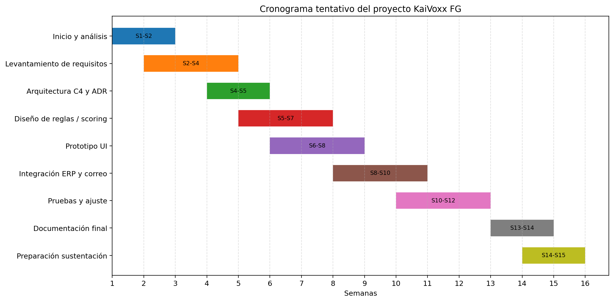

KaiVoxx FG

Sistema de detección de fraude en facturación y pagos

KaiVoxx FG - Sistema de detección de fraude en facturación y pagos

Elaborado por: Camilo Andrés Osorio Mejía

Equipo: Grupo por definir

Cronograma de trabajo

Camilo Andrés Osorio Mejía

KaiVoxx FG

# Plan de fases

| Fase | Semanas | Resultado esperado |
| --- | --- | --- |
| Análisis inicial | 1-2 | Problema, alcance y requisitos base. |
| Diseño | 3-6 | Arquitectura, C4 y documentación técnica. |
| Construcción de artefactos | 5-10 | Requerimientos, casos de uso, riesgos y calidad. |
| Integración y revisión | 10-13 | Coherencia entre documentos y ajustes. |
| Cierre y sustentación | 14-16 | Presentación y paquete final listo para GitHub. |

# Diagrama de Gantt

## Figuras incluidas

