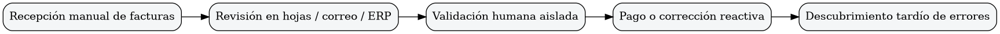
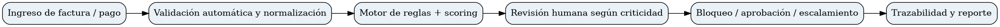
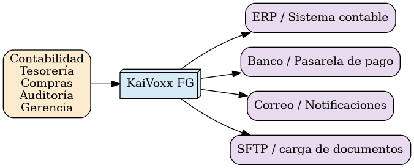
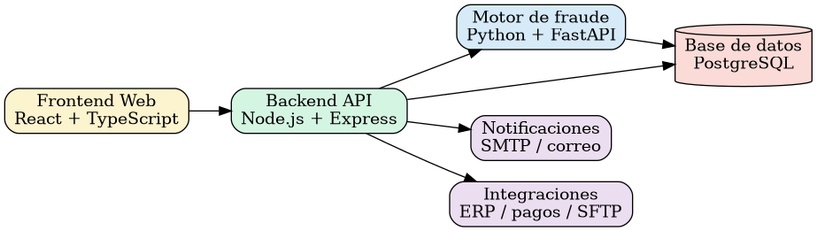
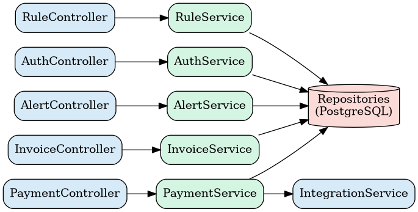
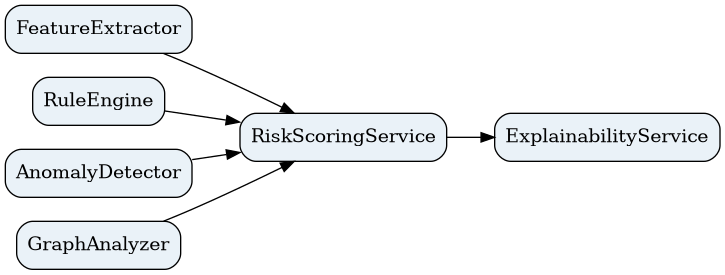

KaiVoxx FG

Sistema de detección de fraude en facturación y pagos

KaiVoxx FG - Sistema de detección de fraude en facturación y pagos

Elaborado por: Camilo Andrés Osorio Mejía

Equipo: Grupo por definir

Arquitectura del sistema

Camilo Andrés Osorio Mejía

KaiVoxx FG

# 1. Flujo As-Is

El proceso actual depende en gran medida de revisión manual, dispersión de datos y validaciones reactivas después de ocurrido el pago.

# 2. Flujo To-Be

La solución objetivo introduce automatización, scoring de riesgo, revisión humana y trazabilidad centralizada.

# 3. Modelo C4 - Contexto (C1)

# 4. Modelo C4 - Contenedores (C2)

# 5. Modelo C4 - Componentes (C3)

Backend API

Motor de detección de fraude

# 6. Decisiones de diseño (ADR)

| ID | Decisión | Justificación |
| --- | --- | --- |
| ADR-01 | Separar el backend del motor de detección | Mantener la lógica transaccional aislada del análisis de riesgo para facilitar escalabilidad, pruebas y evolución independiente. |
| ADR-02 | Usar SaaS multiempresa | Permitir adopción por distintas organizaciones, reduciendo costos de despliegue y mantenimiento. |
| ADR-03 | Elegir PostgreSQL como base principal | Centralizar la trazabilidad y soportar integridad relacional, consultas y auditoría. |
| ADR-04 | Dividir frontend y backend por API | Mejorar mantenibilidad, pruebas y experiencia de usuario sin acoplar la interfaz al negocio. |
| ADR-05 | Incluir revisión humana en casos críticos | Reducir riesgo de falsos positivos/negativos y fortalecer la aceptación operativa. |

## Figuras incluidas

